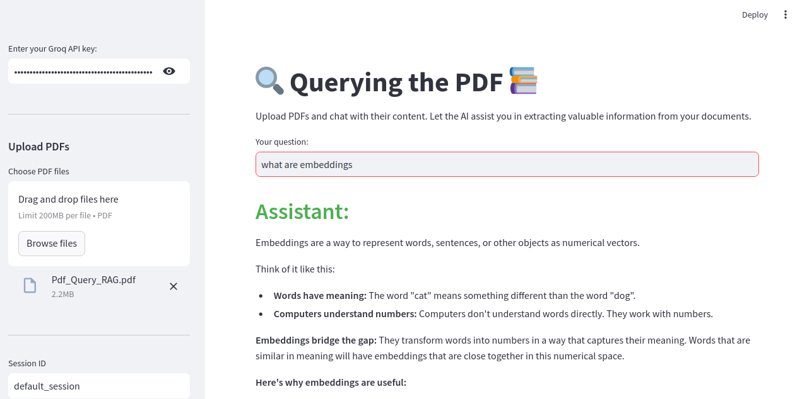

# RAG-System-with-PDF-Integration-and-Chat-History

This project implements a Retrieval-Augmented Generation (RAG) system with a conversational interface using Streamlit. Users can upload PDF documents, interact with their content through a chat interface, and maintain a history of the conversation.

## Requirements

Before running the application, make sure you have the following software installed:

1. **Python**: Python 3.10.
2. **Conda**: Package and environment management system.

### Dependencies

This project relies on several Python libraries, which are listed in the `requirements.txt` file.

## Installation

1. **Clone the Repository**

   ```bash
   git clone https://github.com/vamsi8106/RAG-System-with-PDF-Integration-and-Chat-History.git
2. **Create and Activate a Conda Environment**

   ```bash
   conda create --n rag_env python=3.10
   ```
   ```bash
   conda activate rag_env
3. **Install Dependencies**
   ```bash
   pip install -r requirements.txt     
4. **Set Up Environment Variables**
   
   Create a .env file in the root directory of the project. Add the Hugging Face Token(HF_TOKEN) to the .env file.And keep Groq Cloud key Handy.
5. **Run the Streamlit App**
   ```bash
   streamlit run app.py
   
The Interface looks like

  
